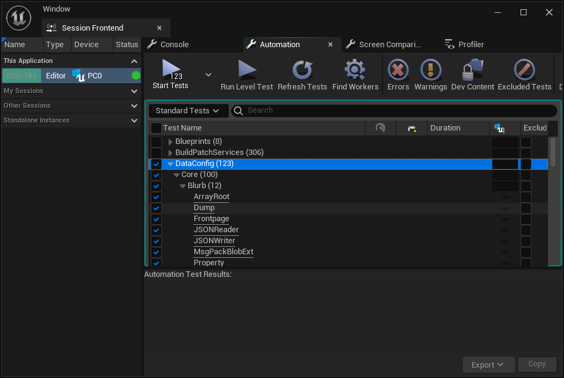

# Automation

One thing we find that's really important when maintaining DataConfig across multiple UE versions, is that proper automation is a must. On this page we document how to run the bundled automation tests.

Note that all instructions shown here are using Windows with a Cmd shell. You'll need to adapt to your system setup.


## DataConfigHeadless

We provide a standalone, command target that runs tests on core, non editor DataConfig features. **This requires a [source build][2] to work**, that means downloaded dists from Epic Launcher can not build this target.


1. Get a copy of Unreal Engine source code. Also checkout [DataConfig supported UE versions](../Integration.md).

2. Run `./GenerateProjectFiles.bat` under Unreal Engine root. Note that you _don't_ need to build the editor. This step would build `UnrealBuildTool` which is enough for the headless target to work.

3. Get a copy of [DataConfig repository][1]. At the folder where `DataConfig.uplugin` and `DataConfig4.uplugin` resides:

    ```shell
    # UE5
    <PathToUE5SourceBuild>/Engine/Build/BatchFiles/RunUBT -project="%CD%/DataConfig.uplugin" DataConfigHeadless Win64 Debug

    # UE4
    <PathToUE4SourceBuild>/Engine/Binaries/DotNET/UnrealBuildTool.exe -project="%CD%/DataConfig4.uplugin" DataConfigHeadless Win64 Debug
    ```

   Note how UE4/5 uses `DataConfig4.uplugin/DataConfig.uplugin` respectively.

4. Run the headless target binary:

    ```shell
    %CD%/Binaries/Win64/DataConfigHeadless-Win64-Debug.exe
    ````

   A success run looks like this:

    ```shell
    LogDataConfigCore: Display: UE Version: 5.1.0, DataConfigCore Version: 1.4.0, 10400
    LogDataConfigCore: Display: Filters: DataConfig.
    -   OK | DataConfig.Core.Property.StackScalarRoots
    -   OK | DataConfig.Extra.SerDe.Base64
    .......
    -   OK | DataConfig.Extra.InlineStructUsage
    -   OK | DataConfig.Core.Property.Primitive1
    Run:  122, Success:  122, Fail:    0
    ```

### Running the benchmarks

`DataConfigHeadless` accepts command line arguments as filters. The benchmarks runs slower are skipped by default.
You can build and run the benchmarks with the commands below:

```shell
# remember to build in Shipping
<PathToUE5SourceBuild>Engine/Build/BatchFiles/RunUBT -project="%CD%/DataConfig.uplugin" DataConfigHeadless Win64 Shipping
%CD%/Binaries/Win64/DataConfigHeadless-Win64-Shipping.exe DataConfigBenchmark
````

### Build and run Linux target with WSL2

UE officially support cross compiling for linux and distribute toolchains on its website. Here we demonstrate how to build the headless
target for Linux and run it under WSL2.

1. Setup WSL2 [following this guide][3]. You should get the latest LTS Ubuntu. Run `wsl lsb_release -ir` to validate it's working.

    ```shell
    > wsl lsb_release -ir
    Distributor ID: Ubuntu
    Release:        22.04
    ```

2. Install UE cross compile toolchain. Grab the installer and install on your machine.

    * [Cross-compile toolchain for UE4][4]
    * [Cross-compile toolchain for UE5][5]

   Note that each UE version matches a different toolchain. You can download and install multiple toolchains and select which to use at build time 
   through environment variable.

3. Build the headless target for Linux.

    ```shell
    # UE5.1
    set LINUX_MULTIARCH_ROOT=<PathToToolchains>/v20_clang-13.0.1-centos7
    <PathToUE5SourceBuild>/Engine/Build/BatchFiles/RunUBT -project="%CD%/DataConfig.uplugin" DataConfigHeadless Linux Debug

    # UE4
    set LINUX_MULTIARCH_ROOT=<PathToToolchains>/v19_clang-11.0.1-centos7
    <PathToUE4SourceBuild>/Engine/Binaries/DotNET/UnrealBuildTool.exe -project="%CD%/DataConfig4.uplugin" DataConfigHeadless Linux Debug
    ```

4. Run the headless target through WSL.

    ```shell
    wsl ./Binaries/Linux/DataConfigHeadless-Linux-Debug 
    ```

   A success run looks like this:

    ```shell
    Using Mimalloc.
    LogInit: Build: ++UE5+Release-5.1-CL-0
    LogInit: Engine Version: 5.1.0-0+++UE5+Release-5.1
    LogInit: Compatible Engine Version: 5.1.0-0+++UE5+Release-5.1
    LogInit: OS: Ubuntu 22.04.1 LTS (5.10.102.1-microsoft-standard-WSL2)
    .......
    LogDataConfigCore: Display: UE Version: 5.1.0, DataConfigCore Version: 1.4.0, 10400
    LogDataConfigCore: Display: Filters: DataConfig.
    -   OK | DataConfig.Core.MsgPack.TestSuite
    -   OK | DataConfig.Core.Property.Blob2
    .......
    -   OK | DataConfig.Core.Serialize.ObjectRef
    -   OK | DataConfig.Core.MsgPack.Extension
    Run:  122, Success:  122, Fail:    0
    LogCore: Engine exit requested (reason: DataConfigHeadless Main Exit)
    LogExit: Preparing to exit.
    LogExit: Object subsystem successfully closed.
    LogExit: Exiting.
    ```

## DcCoreTestsCommandlet

`DataConfigHeadless` is a Program target that does _not_ depend on `Engine` and `UnrealEd` module. It get faster compile and iteration time, but losing functionality to touch any gameplay and editor code.

With the editor target we have a `DcCoreTestsCommandlet` that can be run through the commandline editor target. On top of that this works with pre-built editor downloaded from Epic Launcher.

1. [Integrate DataConfig plugin](../Integration.md) into your project.
   You can also find a clean project bundled at [`Misc/Project`]({{RepoRoot}}Misc/Project).

2. Build the editor target.
   You can do it in Visual Studio or with commands below:

   ```shell
   # UE5
   # build
   <PathToUE5>/Engine/Build/BatchFiles/RunUBT DcProjectEditor Win64 Development %CD%/DcProject5.uproject -NoHotReload -NoEngineChanges
   # run commandlet
   <PathToUE5>/Engine/Binaries/Win64/UnrealEditor-Cmd.exe %CD%/DcProject5.uproject DataConfigEditorExtra.DcCoreTestsCommandlet

   # UE4
   # build
   <PathToUE4>/Engine/Binaries/DotNET/UnrealBuildTool.exe DcProjectEditor Win64 Development %CD%/DcProject4.uproject -NoHotReload -NoEngineChanges
   # run commandlet
   <PathToUE4>/Engine/Binaries/Win64/UE4Editor-Cmd.exe %CD%/DcProject4.uproject DataConfigEditorExtra.DcCoreTestsCommandlet
   ````

   A success run looks like this:

   ```shell
    [2022.10.25-14.33.52:893][  0]LogTextureFormatETC2: Display: ETC2 Texture loading DLL: TextureConverter.dll
    [2022.10.25-14.33.52:903][  0]LogTargetPlatformManager: Display: Loaded TargetPlatform 'Android'
    [2022.10.25-14.33.52:903][  0]LogTargetPlatformManager: Display: Loaded TargetPlatform 'Android_ASTC'
    [2022.10.25-14.33.52:903][  0]LogTargetPlatformManager: Display: Loaded TargetPlatform 'Android_DXT'
    .......
    [2022.10.25-14.39.30:999][  0]LogDataConfigCore: Display: Filters: DataConfig.
    -   OK | DataConfig.Core.RoundTrip.MsgPack_Persistent_StringSoftLazy
    -   OK | DataConfig.EditorExtra.GameplayEffect
    .......
    -   OK | DataConfig.Core.Property.PropertyBuilder3
    -   OK | DataConfig.EditorExtra.BPObjectInstance
    Run:  129, Success:  129, Fail:    0
    ```

## Running automation in the editor

Lastly you can [run and debug automation tests from the editor](../Integration.md#validate-integration). 

It's the most conventional way to run automation and is well supported in DataConfig.



[1]:https://github.com/slowburn-dev/DataConfig "slowburn-dev/DataConfig"
[2]:https://docs.unrealengine.com/5.0/en-US/building-unreal-engine-from-source/
[3]:https://docs.microsoft.com/en-us/windows/wsl/install
[4]:https://docs.unrealengine.com/4.27/en-US/SharingAndReleasing/Linux/GettingStarted/#gettingthetoolchain
[5]:https://docs.unrealengine.com/5.0/en-US/linux-development-requirements-for-unreal-engine/#gettingthetoolchain