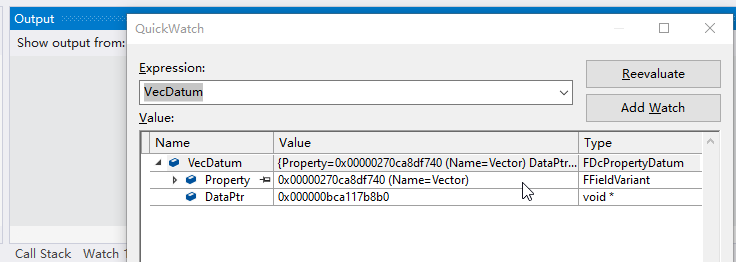

# Debug Dump

`DcAutomationUtils::DumpToLog()` can dump a `FDcPropertyDatum` to a string representation, in which `FDcPropertyDatum` is simply a `(FProperty`, `void*`) fat pointer tuple that can represent anything in the property system:

```c++
// DataConfig/Source/DataConfigTests/Private/DcTestBlurb.cpp
FVector Vec(1.0f, 2.0f, 3.0f);
FDcPropertyDatum VecDatum(TBaseStructure<FVector>::Get(), &Vec);

DcAutomationUtils::DumpToLog(VecDatum);
```

Output would be:

```
-----------------------------------------
# Datum: 'ScriptStruct', 'Vector'
<StructRoot> 'Vector'
|---<Name> 'X'
|---<Float> '1.000000'
|---<Name> 'Y'
|---<Float> '2.000000'
|---<Name> 'Z'
|---<Float> '3.000000'
<StructEnd> 'Vector'
-----------------------------------------
```

Additionally we wrapped this into `gDcDebug` that can be invoked in MSVC immediate window. Calling it during debug would dump into MSVC **Output** window:

```c++
// DataConfig/Source/DataConfigCore/Public/DataConfig/Automation/DcAutomationUtils.h
struct DATACONFIGCORE_API FDcDebug
{
    FORCENOINLINE void DumpStruct(char* StructNameChars, void* Ptr);
    FORCENOINLINE void DumpObject(UObject* Obj);
    FORCENOINLINE void DumpDatum(void* DatumPtr);
};

/// Access `gDcDebugg` in MSVC immediate window:
///
/// - in monolith builds:
/// gDcDebug.DumpObject(Obj)
///
/// - in DLL builds prefix with dll name:
/// ({,,UE4Editor-DataConfigCore}gDcDebug).DumpObject(ObjPtr)

extern FDcDebug gDcDebug;
```

Here's an animated demo showing dumping the vector above _during debug break_ in MSVC:



The full expression to evaluate is:

```
({,,UE4Editor-DataConfigCore}gDcDebug).DumpDatum(&VecDatum)
```

We need DLL name to locate `gDcDebug` in a non monolith build.
