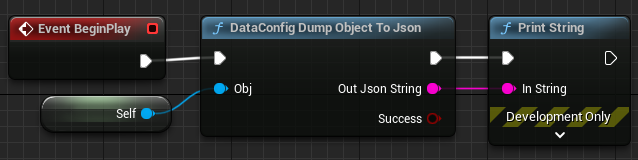
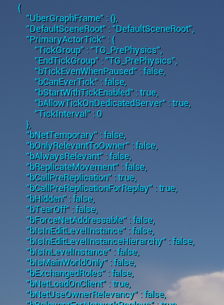

# Examples

Here're some short and quick examples showcasing DataConfig API usage and features. All code shown here can be found in the [repo][1].

## Blueprint Nodes

If you integrated the full DataConfig plugin we have [Blueprint Nodes](../Extra/BlueprintNodes.md) for you to quickly try it out.

Create a Blueprint Actor and setup the `BeginPlay` event like this:

Then place the actor in the level and start play. The JSON string would be print to screen like this.

[1]: https://github.com/slowburn-dev/DataConfig/blob/release/DataConfig/Source/DataConfigTests/Private/DcTestBlurb.cpp "DcTestBlurb.cpp"