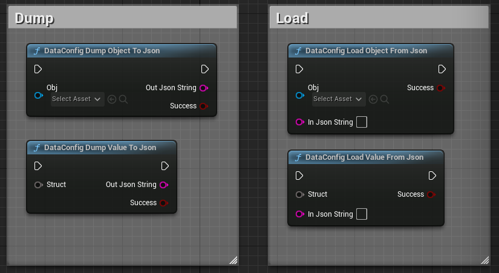
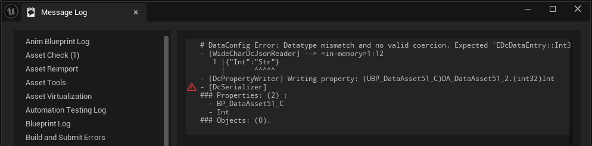

# Blueprint Nodes

We have a set of blueprint nodes that's have similar API as built-in [JsonBlueprintUtilities][1] plugin:

| Category | Name                             | Usage                                           |
| -------- | -------------------------------- | ----------------------------------------------- |
| Dump     | DataConfig Dump Object To JSON   | Dump `UObject` to a JSON string.                |
| Dump     | DataConfig Dump Value To JSON    | Dump arbitrary value to a JSON string.          |
| Load     | DataConfig Load Object From JSON | Load data to `UObject` from a JSON string.      |
| Load     | DataConfig Load Value From JSON  | Load data to arbitrary value from a JSON String |

Some caveats:

* The Dump/Load `Object` APIs always expand the root level object, even if it's a external object reference or an asset. These are by default serialized to a string by DataConfig. Also the `Self` pin only works with these due to some BP limitations.
* Most extra examples are integrated into these nodes so you can try them out without writing C++ code.
  * [AnyStruct](./AnyStruct.md)
  * [Base64](./Base64.md)
  * [InlineStruct](./InlineStruct.md)
  * [Bluerprint Class/Struct/Enum](./Blueprint.md)
  * [Gameplay Tag](./GameplayTag.md)
  * [InstancedStruct](./InstancedStruct.md)
* Error diagnostic is also wired up to message log:
  

[1]: https://dev.epicgames.com/documentation/en-us/unreal-engine/API/Plugins/JsonBlueprintUtilities "JsonBlueprintUtilities"

